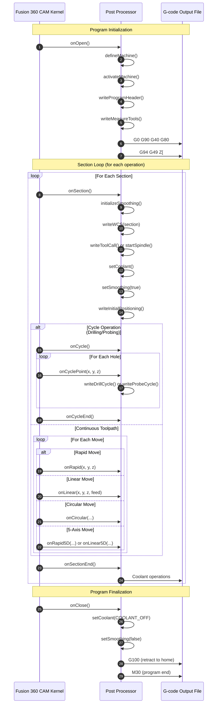
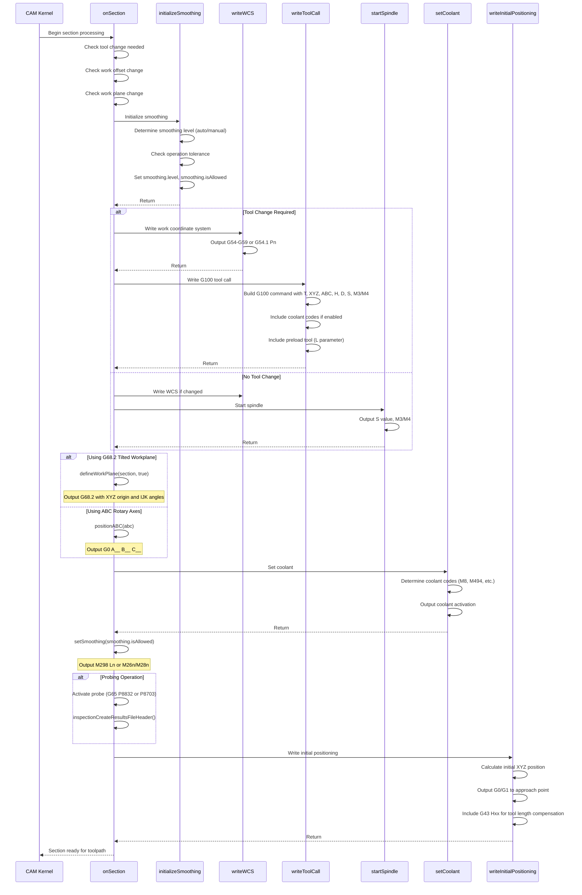

# Brother Speedio Post Processor Flow Documentation

## Table of Contents

- [Overview](#overview)
- [Post Processor Lifecycle](#post-processor-lifecycle)
- [Execution Flow Diagram](#execution-flow-diagram)
- [Architecture Overview](#architecture-overview)
- [Property System](#property-system)
- [Section Processing Flow](#section-processing-flow)
- [Machine-Specific Behaviors](#machine-specific-behaviors)
- [G-Code Generation Patterns](#g-code-generation-patterns)
- [State Management](#state-management)

## Overview

The Brother Speedio post processor is an Autodesk Common Post Specification (CPS) file that converts Fusion 360 CAM toolpaths into G-code compatible with Brother Speedio CNC machines (S300X1, S500X1, S700X1). This document describes the overall architecture and execution flow of the post processor.

**Key Characteristics:**
- **Language**: JavaScript (CPS variant)
- **Target Machines**: Brother Speedio S300X1, S500X1, S700X1
- **Capabilities**: 3-axis, 4-axis (A-axis), 5-axis (AC-trunnion), probing
- **G-code Dialect**: Fanuc-based with Brother-specific extensions
- **Special Features**: G100 tool change macro, M298 smoothing, dual probing systems

## Post Processor Lifecycle

The post processor follows a strict lifecycle managed by the Fusion 360 CAM kernel. Functions are called in a specific order:



## Execution Flow Diagram

This diagram shows the detailed flow of post processor execution with key decision points:

```mermaid
flowchart TD
    Start([Program Start]) --> OnOpen[onOpen]
    OnOpen --> DefMachine[defineMachine<br/>Configure machine axes]
    DefMachine --> ActMachine[activateMachine<br/>Enable optimizations]
    ActMachine --> WriteProgramHeader[writeProgramHeader<br/>Output comments & tool list]
    WriteProgramHeader --> WriteMeasureTools{measureTools<br/>property enabled?}
    WriteMeasureTools -->|Yes| MeasureLoop[writeMeasureTools<br/>Generate tool measurement code]
    WriteMeasureTools -->|No| InitCodes
    MeasureLoop --> InitCodes[Output G0 G90 G40 G80<br/>G94 G49]

    InitCodes --> SectionLoop{More sections?}
    SectionLoop -->|Yes| OnSection[onSection]
    OnSection --> CheckToolChange{Tool change<br/>needed?}

    CheckToolChange -->|Yes| CancelSmoothing[setSmoothing false]
    CheckToolChange -->|No| CheckWorkOffset
    CancelSmoothing --> WriteWCS[writeWCS]
    WriteWCS --> G100ToolCall[writeToolCall<br/>G100 macro]
    G100ToolCall --> DefineWorkPlane

    CheckWorkOffset{New work<br/>offset?} -->|Yes| WriteWCS
    CheckWorkOffset -->|No| DefineWorkPlane

    DefineWorkPlane{Using tilted<br/>workplane?} -->|Yes| G682[defineWorkPlane<br/>Output G68.2]
    DefineWorkPlane -->|No| PositionABC[positionABC<br/>Rotate axes]
    G682 --> StartSpindle
    PositionABC --> StartSpindle

    StartSpindle[startSpindle<br/>M3/M4] --> SetCoolant[setCoolant<br/>M8/M494]
    SetCoolant --> InitSmoothing[initializeSmoothing<br/>Determine accuracy level]
    InitSmoothing --> ActivateSmoothing[setSmoothing true<br/>M298/M260/M280]

    ActivateSmoothing --> InitialPos[writeInitialPositioning<br/>G0 XYZ]
    InitialPos --> CheckCycle{Cycle<br/>operation?}

    CheckCycle -->|Yes| OnCycle[onCycle<br/>G17]
    OnCycle --> CyclePoints[Loop: onCyclePoint]
    CyclePoints --> CheckProbe{Probing<br/>cycle?}
    CheckProbe -->|Yes| ProbeCycle[writeProbeCycle<br/>G65 P8700/P8811]
    CheckProbe -->|No| DrillCycle[writeDrillCycle<br/>G81-G89]
    ProbeCycle --> CycleEnd
    DrillCycle --> CycleEnd[onCycleEnd<br/>G80]

    CheckCycle -->|No| MoveLoop[Loop: Motion commands]
    MoveLoop --> CheckMove{Move type?}
    CheckMove -->|Rapid| OnRapid[onRapid<br/>G0 XYZ]
    CheckMove -->|Linear| OnLinear[onLinear<br/>G1 XYZ F]
    CheckMove -->|Circular| OnCircular[onCircular<br/>G2/G3]
    CheckMove -->|5-Axis| OnLinear5D[onLinear5D<br/>G1 XYZABC]
    OnRapid --> MoveLoop
    OnLinear --> MoveLoop
    OnCircular --> MoveLoop
    OnLinear5D --> CheckMoreMoves{More<br/>moves?}

    CheckMoreMoves -->|Yes| MoveLoop
    CheckMoreMoves -->|No| OnSectionEnd
    CycleEnd --> OnSectionEnd

    OnSectionEnd[onSectionEnd<br/>Washdown coolant if configured] --> SectionLoop

    SectionLoop -->|No| OnClose[onClose]
    OnClose --> CloseCoolant[setCoolant COOLANT_OFF]
    CloseCoolant --> Washdown{Washdown<br/>at program end?}
    Washdown -->|Yes| M400[M400/M401]
    Washdown -->|No| PartsCounter
    M400 --> PartsCounter{Parts counter<br/>enabled?}
    PartsCounter -->|Yes| M211[M211-M214]
    PartsCounter -->|No| FinalRetract
    M211 --> FinalRetract[G100 T1 G90 G53<br/>Return to home]
    FinalRetract --> M30[M30<br/>Program end]
    M30 --> End([End])

    style OnOpen fill:#e1f5ff
    style OnSection fill:#fff4e1
    style OnClose fill:#ffe1e1
    style G100ToolCall fill:#e1ffe1
    style G682 fill:#ffe1f5
    style ProbeCycle fill:#f5e1ff
```



## Architecture Overview

### Code Structure

The post processor is organized into several logical layers:

1. **Configuration Layer** (Lines 1-543)
   - Properties definition (user-configurable settings)
   - WCS definitions
   - Format specifiers (gFormat, mFormat, xyzFormat, etc.)
   - Output variables (xOutput, yOutput, zOutput, etc.)
   - Settings objects (coolant, smoothing, retract, etc.)

2. **Machine Definition Layer** (Lines 544-607)
   - `defineMachine()`: Configures machine kinematics
   - Trunnion/A-axis setup
   - TCP and multi-axis feedrate configuration

3. **Lifecycle Callback Layer** (Lines 624-2522)
   - Core lifecycle functions: `onOpen()`, `onSection()`, `onClose()`
   - Motion functions: `onRapid()`, `onLinear()`, `onCircular()`
   - Cycle functions: `onCycle()`, `onCyclePoint()`, `onCycleEnd()`
   - Event handlers: `onCommand()`, `onParameter()`, `onAction()`

4. **Helper Function Layer** (Lines 2523-4329)
   - Output formatting: `writeBlock()`, `writeComment()`, `formatComment()`
   - Tool management: `writeToolCall()`, `startSpindle()`, `getBodyLength()`
   - Work plane: `defineWorkPlane()`, `setWorkPlane()`, `cancelWorkPlane()`
   - Positioning: `writeInitialPositioning()`, `positionABC()`, `writeRetract()`
   - Probing: `writeProbeCycle()`, `getProbingArguments()`, `setProbeAngle()`
   - Smoothing: `initializeSmoothing()`, `setSmoothing()`
   - Coolant: `setCoolant()`, `getCoolantCodes()`

### Global State Variables

The post processor maintains several critical state variables:

```javascript
// Tool state
var toolChecked = false;          // Tool has been measured
var measureTool = false;          // Tool needs measurement
var forceSpindleSpeed = true;     // Force spindle speed output

// Coolant state
var currentCoolantMode = COOLANT_OFF;
var forceCoolant = false;

// Smoothing state
var smoothing = {
  isActive: false,      // Current smoothing state
  isAllowed: false,     // Allowed for this operation
  isDifferent: false,   // Different from previous
  level: -1,            // Active smoothing level (1-6, 21-23)
  tolerance: -1,        // Operation tolerance
  force: false,         // Force output
  cancel: false         // Cancel before tool change
};

// Work plane state
var currentWorkPlaneABC = undefined;
var currentWorkOffset = undefined;

// Probing state
var probeVariables = {
  outputRotationCodes: false,
  compensationXY: undefined
};
```

## Property System

The post processor uses a comprehensive property system for configuration. Properties are defined in the `properties` object and can be overridden per-post or per-operation.

### Property Categories

#### Machine Configuration
```javascript
hasAAxis: false              // Enable A-axis rotary
useTrunnion: false          // Enable AC-trunnion (5-axis)
probingType: "Renishaw"     // "Renishaw" or "Blum"
```

#### Tool Management
```javascript
preloadTool: false          // Preload next tool in G100
measureTools: false         // Measure tools at program start
confirmToolLengths: false   // Verify tool lengths match CAM
```

#### Smoothing/Accuracy
```javascript
smoothingMode: "M298"              // "A", "B", or "M298"
useSmoothing: "9999"              // -1=off, 9999=auto, 1-6=levels
smoothingCriteria: "stock"        // "stock" or "tolerance"
rapidTransitions: false           // Disable smoothing during rapids
accuracyOverride: "-9999"         // Per-operation override
```

#### Positioning
```javascript
safePositionMethod: "G53"         // "G28", "G30", "G53", "clearanceHeight"
positionAtEnd: "home"             // "home", "noMove", "centerAtDoor"
separateZOnToolChange: false      // XY first, then Z in G100
```

#### Multi-Axis
```javascript
useTiltedWorkplane: false         // Use G68.2 for 3+2
useInverseTime: false            // Inverse time feedrates
```

## Section Processing Flow

Each toolpath operation in Fusion 360 CAM is represented as a "section". The `onSection()` function is the heart of the post processor, coordinating all aspects of generating G-code for that operation.

### Section Processing Sequence



### Key Section Variables

```javascript
var insertToolCall = isToolChangeNeeded("number") || forceSectionRestart;
var newWorkOffset = isNewWorkOffset() || forceSectionRestart;
var newWorkPlane = isNewWorkPlane() || forceSectionRestart;
var optionalSection = currentSection.isOptional() || (isProbeOperation() && probeOutputAsOptional);
```

## Machine-Specific Behaviors

### G100 Tool Change System

The Brother Speedio uses a proprietary G100 macro for tool changes that combines multiple operations:

**G100 Syntax:**
```gcode
G100 T[tool] X[x] Y[y] Z[z] A[a] B[b] C[c] L[preload] H[offset] D[offset] S[speed] M[3|4] M[coolant]
```

**What G100 Does:**
1. Retracts Z-axis to safe height
2. Moves to tool change position
3. Executes tool change (ATC)
4. Optionally preloads next tool (L parameter)
5. Moves to XYZ position specified
6. Rotates ABC axes to specified angles
7. Activates tool length compensation (H offset)
8. Starts spindle at S speed in M3/M4 direction
9. Activates coolant if specified

**Implementation:**
```javascript
// From writeToolCall() -> onCommand(COMMAND_LOAD_TOOL)
writeToolBlock(gFormat.format(100),
  "T" + toolFormat.format(tool.number),
  xOutput.format(start.x),
  yOutput.format(start.y),
  gFormat.format(getOffsetCode()),          // G43 or G43.4/G43.5 for TCP
  zOutput.format(start.z),
  abc ? aOutput.format(abc.x) : undefined,
  abc ? bOutput.format(abc.y) : undefined,
  abc ? cOutput.format(abc.z) : undefined,
  (preloadTool) ? "L" + toolFormat.format(preloadTool.number) : undefined,
  hFormat.format(tool.lengthOffset),
  conditional(rotateSpindle, diameterOffsetFormat.format(tool.diameterOffset)),
  conditional(rotateSpindle, sOutput.format(spindleSpeed)),
  conditional(rotateSpindle, mFormat.format(tool.clockwise ? 3 : 4)),
  coolantCodes
);
```

### Probing Systems

The post processor supports two probing systems with different macro interfaces:

#### Renishaw System
- **Macro Range**: P8810-P8832
- **Probe Activation**: G65 P8832 (turn on probe)
- **Protected Move**: G65 P8810 (safe positioning)
- **Single Axis Probe**: G65 P8811 X/Y/Z Q[overtravel] [params]
- **Wall Probe**: G65 P8812
- **Circular Probe**: G65 P8814
- **Partial Circle**: G65 P8823

#### Blum System
- **Macro Range**: P8700-P8703
- **Probe Activation**: G65 P8703 A1 M1 X[#5001] (zero move to activate)
- **Protected Move**: G65 P8703 A1 M3
- **Probing**: G65 P8700 A1 M3 [axis-specific params] Q[overtravel]

**Example Renishaw Probing:**
```gcode
G65 P8832                    ; Activate probe
G65 P8810 X100.0 Y50.0 F1000 ; Protected move to position
G65 P8811 X105.0 Q5.0 S54    ; Probe X+ direction, update WCS G54
```

**Example Blum Probing:**
```gcode
G65 P8703 A1 M1 X[#5001]     ; Activate probe (zero move)
G65 P8703 A1 M3 X100.0 Y50.0 ; Protected move
G65 P8700 A1 M3 I100.0 X105.0 Q5.0 S54 ; Probe X, update WCS
```

### Trunnion Configuration

When `useTrunnion` property is enabled, the post processor configures a 5-axis AC-trunnion:

```javascript
var aAxis = createAxis({
  coordinate: 0,           // A-axis (rotation around X)
  table: true,            // Table-mounted (not head)
  axis: [1, 0, 0],       // X-axis vector
  range: [-30, 120],     // A-axis limits
  preference: 1,
  tcp: false
});

var cAxis = createAxis({
  coordinate: 2,           // C-axis (rotation around Z)
  table: true,
  axis: [0, 0, 1],       // Z-axis vector
  cyclic: true,          // 360° rotation
  tcp: false
});
```

**Multi-Axis Positioning:**
- Retracts before rotating (safety)
- Unlocks multi-axis: `M201` (COMMAND_UNLOCK_MULTI_AXIS)
- Outputs rotation: `G0 A[a] C[c]`
- Locks multi-axis after positioning: `M200` (COMMAND_LOCK_MULTI_AXIS)

### Smoothing Modes

Brother Speedio supports three smoothing/high-accuracy modes:

#### Mode A (M260-M269)
```gcode
M260 ; Standard (level 0)
M265 ; Roughing (level 5)
M263 ; Medium rough (level 3)
M264 ; Medium rough S (level 4)
M261 ; Finishing (level 1)
M262 ; Finishing S (level 2)
M269 ; Smoothing off
```

#### Mode B (M280-M289)
- Same mapping as Mode A, different M-code range

#### Mode M298 (Preferred)
```gcode
M298 L0  ; Off
M298 L1  ; Standard
M298 L2  ; Roughing
M298 L3  ; Medium rough
M298 L4  ; Medium rough (S)
M298 L5  ; Finishing
M298 L6  ; Finishing (S)
M298 L21 ; Accuracy spec A
M298 L22 ; Accuracy spec B
M298 L23 ; Accuracy spec C
```

**Automatic Level Selection:**
Based on `smoothingCriteria` property:
- **Stock to Leave**: Compares `stockToLeave` to thresholds
  - ≥ 0.5mm → Roughing (L2)
  - > 0.1mm → Semi-finishing (L3/L4)
  - > 0.05mm → Semi-finishing (L1)
  - ≤ 0.05mm → Finishing (L5)
- **Tolerance**: Compares `operation:tolerance` to same thresholds

**Special Handling:**
- Smoothing disabled for probing and drilling cycles
- Cancelled before tool changes
- Can be disabled during rapid transitions (adaptive/pocket strategies)

### G68.2 Tilted Workplane

When `useTiltedWorkplane` is enabled, 3+2 operations use G68.2 instead of ABC positioning:

```gcode
G68.2 X[origin.x] Y[origin.y] Z[origin.z] I[angle.x] J[angle.y] K[angle.z]
G53.1 ; Activate machine coordinate system
```

**Advantages:**
- Tool paths programmed in the tilted plane coordinate system
- Machine handles coordinate transformation
- More accurate for complex geometries

**Sequence:**
1. Position ABC axes (if multi-axis machine)
2. Cancel any existing rotation (G69)
3. Output G68.2 with work origin and Euler angles
4. Output G53.1 to activate
5. All subsequent moves are in the tilted coordinate system
6. Cancel with G69 at section end or before WCS change

## G-Code Generation Patterns

### Motion Commands

**Rapid Positioning:**
```javascript
function onRapid(_x, _y, _z) {
  if (pendingRadiusCompensation >= 0) {
    error("Radius compensation mode cannot be changed at rapid traversal.");
  }
  if (settings.probing.probeOn && !productionMode) {
    protectedProbeMove(undefined, _x, _y, _z);  // Use protected probe move
  } else {
    writeBlock(gMotionModal.format(0), x, y, z);  // G0 X__ Y__ Z__
  }
}
```

**Linear Interpolation:**
```javascript
function onLinear(_x, _y, _z, feed) {
  if (pendingRadiusCompensation >= 0) {
    // First move with radius compensation
    writeBlock(gPlaneModal.format(17));
    writeBlock(gMotionModal.format(1), gFormat.format(41/42), x, y, z, d, f);
  } else {
    writeBlock(gMotionModal.format(1), x, y, z, f);  // G1 X__ Y__ Z__ F__
  }
}
```

**Circular Interpolation:**
```javascript
function onCircular(clockwise, cx, cy, cz, x, y, z, feed) {
  // Check for active G68 rotation - can't change planes
  if ((gRotationModal.getCurrent() == 68 || gRotationModal.getCurrent() == 68.2) &&
      (getCircularPlane() != PLANE_XY)) {
    linearize(tolerance);  // Convert to linear moves
    return;
  }

  if (isFullCircle()) {
    // Full circle using IJK (center offset)
    writeBlock(gPlaneModal.format(17),
               gMotionModal.format(clockwise ? 2 : 3),
               iOutput.format(cx - start.x),
               jOutput.format(cy - start.y),
               getFeed(feed));
  } else if (!getProperty("useRadius")) {
    // Arc using IJK
    writeBlock(gPlaneModal.format(17),
               gMotionModal.format(clockwise ? 2 : 3),
               xOutput.format(x), yOutput.format(y), zOutput.format(z),
               iOutput.format(cx - start.x), jOutput.format(cy - start.y),
               getFeed(feed));
  } else {
    // Arc using radius (R parameter)
    var r = getCircularRadius();
    if (toDeg(getCircularSweep()) > 180) { r = -r; }  // >180° arcs need negative R
    writeBlock(gPlaneModal.format(17),
               gMotionModal.format(clockwise ? 2 : 3),
               xOutput.format(x), yOutput.format(y), zOutput.format(z),
               "R" + rFormat.format(r),
               getFeed(feed));
  }
}
```

### Drilling Cycles

The post processor supports all standard Fanuc drilling cycles:

| Cycle Type | G-Code | Parameters | Notes |
|-----------|--------|------------|-------|
| Drilling | G81 | XYZ R F | Simple drill |
| Counter-boring | G82 | XYZ R P F | With dwell |
| Chip-breaking | G73 | XYZ R Q F | Peck drill |
| Deep-drilling | G83 | XYZ R Q F | Full retract peck |
| Tapping | G77/G78 | XYZ R I/J S L | Pitch-based (preferred) |
| Tapping | G84/G74 | XYZ R P S F | Feed-based |
| Reaming | G85/G89 | XYZ R F [P] | With/without dwell |
| Boring | G76/G86/G88 | XYZ R Q P F | Various boring types |

**Tapping Example:**
```gcode
; Using pitch (G77) - preferred method
G98 G77 X50.0 Y50.0 Z-15.0 R5.0 I1.5 S500 L1000

; Using feedrate (G84) - legacy
G98 G84 X50.0 Y50.0 Z-15.0 R5.0 P0.0 S500 F750
```

### Coolant Management

Coolant is managed through the `setCoolant()` function:

**Coolant Codes:**
```javascript
M8   // Flood coolant on
M9   // Coolant off
M494 // Through-tool coolant on
M495 // Through-tool coolant off
M402 // Air blast on
M403 // Air blast off
M400 // Washdown coolant on
M401 // Washdown coolant off
```

**Combined Coolants:**
```gcode
M8 M494  ; Flood + through-tool (output on same line if singleLineCoolant=true)
```

## State Management

### Modal Groups

The post processor carefully manages modal G-code groups to minimize output:

```javascript
var gMotionModal = createOutputVariable({control:CONTROL_FORCE}, gFormat);     // Group 1: G0-G3
var gPlaneModal = createOutputVariable({onchange:...}, gFormat);                // Group 2: G17-G19
var gAbsIncModal = createOutputVariable({}, gFormat);                           // Group 3: G90-G91
var gFeedModeModal = createOutputVariable({}, gFormat);                         // Group 5: G94-G95
var gUnitModal = createOutputVariable({}, gFormat);                             // Group 6: G20-G21
var gCycleModal = createOutputVariable({control:CONTROL_FORCE}, gFormat);      // Group 9: G81-G89
var gRetractModal = createOutputVariable({}, gFormat);                          // Group 10: G98-G99
var gRotationModal = createOutputVariable({onchange:...}, gFormat);            // Group 16: G68-G69
```

**Modal Output Variables:**
Only output when value changes:
```javascript
var xOutput = createOutputVariable({prefix:"X"}, xyzFormat);
// First call: xOutput.format(100.0) → "X100.0"
// Second call: xOutput.format(100.0) → "" (no output, value unchanged)
// Third call: xOutput.format(150.0) → "X150.0"
```

### Force Functions

Override modal suppression when needed:

```javascript
function forceFeed() {
  feedOutput.reset();  // Next feed output is forced
}

function forceXYZ() {
  xOutput.reset();
  yOutput.reset();
  zOutput.reset();
}

function forceABC() {
  aOutput.reset();
  bOutput.reset();
  cOutput.reset();
}

function forceAny() {
  forceXYZ();
  forceABC();
  forceFeed();
}

function forceModals() {
  gMotionModal.reset();
  gPlaneModal.reset();
  gAbsIncModal.reset();
  gFeedModeModal.reset();
  // ... reset all modal groups
}
```

### Retraction State

```javascript
var retracted = false;  // True when Z is at safe/retract height

// Set to true when:
// - Tool change occurs (G100 retracts)
// - writeRetract() is called
// - onMoveToSafeRetractPosition() is called

// Set to false when:
// - Z-axis moves (via zOutput onchange callback)
```

This state prevents unnecessary Z retractions and ensures safe rotary axis movements.

---

## Related Documentation

- [FUNCTIONS.md](./FUNCTIONS.md) - Detailed function reference with call graphs and examples
- [brother speedio.cps](../brother%20speedio.cps) - Source code

## Revision History

| Date | Version | Description |
|------|---------|-------------|
| 2025-11-17 | 1.1 | Added sequence number management documentation (line-based increment every 42 lines) |
| 2025-11-17 | 1.0 | Initial documentation generated |
