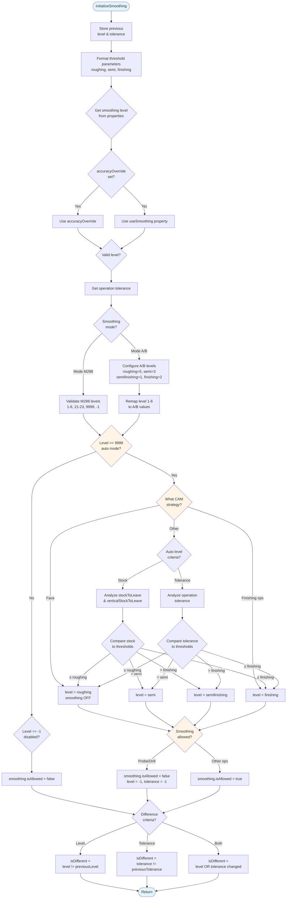

# initializeSmoothing

## Overview

**File**: `brother speedio.cps`
**Line**: 3522
**Category**: Smoothing Functions

## Signature

```javascript
function initializeSmoothing()
```

## Description

Initializes the smoothing configuration for the current section by analyzing the operation tolerance, stock to leave, and CAM strategy. This function determines the appropriate smoothing level based on whether the operation is roughing, semi-finishing, or finishing, and configures the smoothing mode (A, B, or M298) accordingly.

The function implements automatic smoothing level selection using one of two criteria:
- **Stock-based**: Analyzes `stockToLeave` and `verticalStockToLeave` parameters
- **Tolerance-based**: Uses the operation's tolerance value

## Parameters

None

## Returns

**Type**: `void`
No return value. Modifies the global `smoothing` object state.

## G-Code Impact

**Indirect G-code impact** - This function sets up the state that will later be used by `setSmoothing()` to output:
- Mode A: `M260-M265` (enable) or `M269` (disable)
- Mode B: `M280-M285` (enable) or `M289` (disable)
- Mode M298: `M298 L1-L6` (enable) or `M298 L0` (disable)

## Function Flow



## State Modifications

This function modifies the global `smoothing` object:

```javascript
smoothing.level        // Smoothing level (-1, 1-6, 21-23, or 9999)
smoothing.tolerance    // Operation tolerance value
smoothing.isAllowed    // Whether smoothing is allowed for this operation
smoothing.isDifferent  // Whether smoothing changed from previous section
```

## Called By

- `onSection()` at line 725 - Called once per toolpath section during initialization

**Call context**:
```javascript
// From onSection() - line 725
initializeSmoothing(); // initialize smoothing mode
```

## Calls To

- `getProperty()` - Gets property values (accuracyOverride, useSmoothing, smoothingMode)
- `getParameter()` - Gets operation parameters (tolerance, stockToLeave, verticalStockToLeave)
- `xyzFormat.getResultingValue()` - Formats numeric values
- `parseInt()` - Parses string to integer
- `isNaN()` - Checks for valid numbers
- `error()` - Throws validation errors for invalid smoothing levels
- `isDrillingCycle()` - Checks if current section is a drilling cycle

## Usage Example

```javascript
// Real usage from brother speedio.cps:725 (in onSection)
function onSection() {
  var forceSectionRestart = optionalSection && !currentSection.isOptional();
  optionalSection = currentSection.isOptional() || (isProbeOperation() && probeOutputAsOptional);

  var insertToolCall = isToolChangeNeeded("number") || forceSectionRestart;
  var newWorkOffset = isNewWorkOffset() || forceSectionRestart;
  var newWorkPlane = isNewWorkPlane() || forceSectionRestart;

  initializeSmoothing(); // initialize smoothing mode

  // ... rest of section processing
}
```

## Smoothing Modes

### Mode A (M260-M269)
- **M260**: Level 0 (OFF equivalent)
- **M261-M265**: Levels 1-5
- **M269**: Disable smoothing

**Level mapping** (1-6 → A/B):
- 1 → 5, 2 → 3, 3 → 4, 4 → 1, 5 → 2, 6 → 0

### Mode B (M280-M289)
- **M280**: Level 0 (OFF equivalent)
- **M281-M285**: Levels 1-5
- **M289**: Disable smoothing

Uses same level mapping as Mode A.

### Mode M298
- **M298 L0**: Disable smoothing
- **M298 L1-L6**: Standard smoothing levels
- **M298 L21-L23**: High-accuracy smoothing levels

Direct level mapping (no remapping needed).

## Smoothing Level Selection Logic

### Automatic Selection (level = 9999)

| Condition | Stock Criteria | Tolerance Criteria | Result Level |
|-----------|----------------|-------------------|--------------|
| Face operations | - | - | `roughing` (OFF) |
| Finishing strategies* | - | - | `finishing` |
| Stock ≥ roughing threshold | ✓ | - | `roughing` |
| Stock > semi threshold | ✓ | - | `semi` |
| Stock > finishing threshold | ✓ | - | `semifinishing` |
| Stock ≤ finishing threshold | ✓ | - | `finishing` |
| Tolerance ≥ roughing threshold | - | ✓ | `roughing` |
| Tolerance > semi threshold | - | ✓ | `semi` |
| Tolerance > finishing threshold | - | ✓ | `semifinishing` |
| Tolerance ≤ finishing threshold | - | ✓ | `finishing` |

*Finishing strategies: contour2d, chamfer2d, slot, path3d, bore, thread

### Disallowed Operations

Smoothing is **automatically disabled** for:
- Probe operations (`TOOL_PROBE`)
- All drilling cycles (checked via `isDrillingCycle()`)
- When `useSmoothing = -1`

## Related Functions

- [`setSmoothing()`](setSmoothing.md) - Outputs G-code to enable/disable smoothing
- [`onSection()`](onSection.md) - Calls this function during section initialization
- [`isDrillingCycle()`](isDrillingCycle.md) - Checks if smoothing should be disabled

## Property Dependencies

| Property | Purpose | Default |
|----------|---------|---------|
| `accuracyOverride` | Manual smoothing level override | -9999 (disabled) |
| `useSmoothing` | Fallback smoothing level | -1 (disabled) |
| `smoothingMode` | Smoothing system to use | "M298" |
| `operation:tolerance` | CAM operation tolerance | varies |
| `operation:stockToLeave` | Radial stock to leave | 0 |
| `operation:verticalStockToLeave` | Axial stock to leave | 0 |

## Settings Dependencies

```javascript
settings.smoothing = {
  autoLevelCriteria: "stock" | "tolerance",  // Auto selection method
  differenceCriteria: "level" | "tolerance" | "both",  // Change detection
  thresholdRoughing: 0.5,      // Roughing threshold (mm)
  thresholdSemiFinishing: 0.2, // Semi-finishing threshold (mm)
  thresholdFinishing: 0.05,    // Finishing threshold (mm)
  roughing: 5,                 // Roughing level
  semi: 3,                     // Semi level
  semifinishing: 1,            // Semi-finishing level
  finishing: 2,                // Finishing level
  off: 0                       // OFF level
}
```

## CNC Machining Context

### Why Smoothing Matters

Smoothing (also called "high-speed machining mode" or "nano smoothing") is critical for CNC surface finish quality:

1. **Trajectory Optimization**: Smooths sharp corners in toolpath to maintain constant feed rate
2. **Surface Finish**: Reduces feed rate fluctuations that cause witness marks
3. **Cycle Time**: Higher smoothing levels allow faster machining on complex 3D surfaces
4. **Tool Life**: Reduces sudden direction changes that stress the cutting tool

### Brother Speedio Implementation

The Brother Speedio series supports three smoothing systems:
- **Mode A**: Legacy smoothing (M260-M269)
- **Mode B**: Alternative smoothing (M280-M289)
- **Mode M298**: Latest nano-smoothing with extended levels

Each mode has different algorithms for trajectory optimization and lookahead distance.

## Notes

- This function must be called **before** `setSmoothing()` in each section
- Changes to smoothing level between sections are tracked via `isDifferent`
- The `force` flag can override the difference check to force smoothing output
- Face operations typically disable smoothing to maximize material removal rate
- Finishing operations use the highest smoothing level for best surface quality
- Invalid smoothing levels will throw an error and halt post processing
