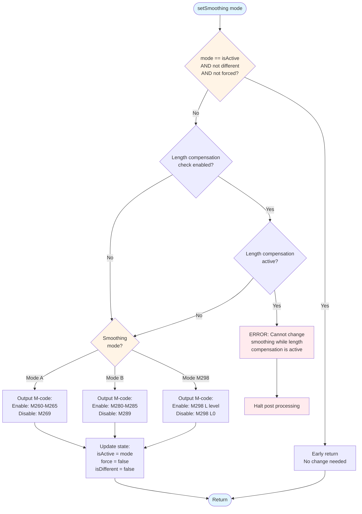
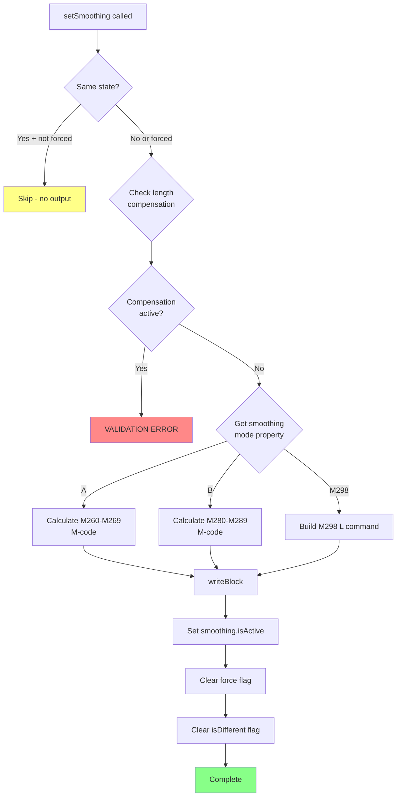
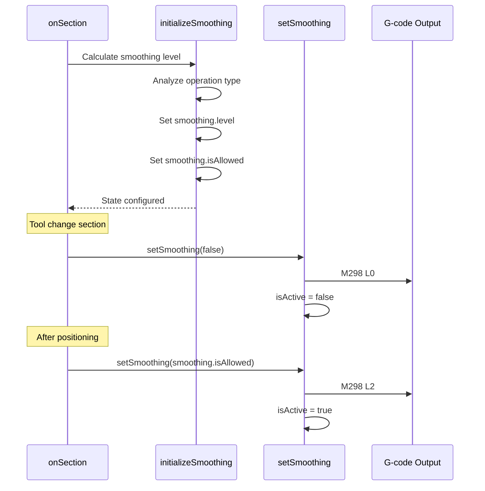

# setSmoothing

## Overview

**File**: `brother speedio.cps`
**Line**: 683
**Category**: Smoothing Functions

## Signature

```javascript
function setSmoothing(mode)
```

## Description

Outputs G-code to enable or disable smoothing (high-speed machining mode) on the Brother Speedio CNC machine. This function checks if smoothing needs to be changed and outputs the appropriate M-code based on the configured smoothing mode (A, B, or M298). It validates that length compensation is not active when attempting to change smoothing state.

## Parameters

- **`mode`** (boolean) - `true` to enable smoothing, `false` to disable smoothing

## Returns

**Type**: `void`
No return value. Outputs G-code to the NC program.

## G-Code Impact

**Direct G-code output** - Generates one of the following M-codes:

### Mode A (M260-M269)
- **Enable**: `M260-M265` (based on `smoothing.level`)
  - M260 = Level 0 (equivalent to OFF)
  - M261 = Level 1
  - M262 = Level 2
  - M263 = Level 3
  - M264 = Level 4
  - M265 = Level 5
- **Disable**: `M269`

### Mode B (M280-M289)
- **Enable**: `M280-M285` (based on `smoothing.level`)
  - M280 = Level 0 (equivalent to OFF)
  - M281 = Level 1
  - M282 = Level 2
  - M283 = Level 3
  - M284 = Level 4
  - M285 = Level 5
- **Disable**: `M289`

### Mode M298 (Nano-Smoothing)
- **Enable**: `M298 L[level]` where level = `smoothing.level` (1-6 or 21-23)
- **Disable**: `M298 L0`

## Function Flow



## Execution Logic



## State Modifications

This function modifies the global `smoothing` object:

```javascript
smoothing.isActive     = mode;  // Current smoothing state (true/false)
smoothing.force        = false; // Clear force flag after output
smoothing.isDifferent  = false; // Clear difference flag after output
```

## Called By

Called from multiple locations throughout the post processor:

1. **`onSection()`** at line 733 - Disable smoothing for tool changes:
   ```javascript
   if ((insertToolCall && !isFirstSection()) || smoothing.cancel) {
     setSmoothing(false);
   }
   ```

2. **`onSection()`** at line 785 - Enable smoothing after positioning:
   ```javascript
   setSmoothing(smoothing.isAllowed);
   ```

3. **`onClose()`** at line 2439 - Disable smoothing at program end:
   ```javascript
   setSmoothing(false);
   ```

4. **`onCommand()`** at line 2454, 2456 - Handle smoothing override commands:
   ```javascript
   if (command == COMMAND_OPTIONAL_STOP) {
     setSmoothing(false);
   } else {
     setSmoothing(smoothing.isAllowed);
   }
   ```

## Calls To

- `getProperty("smoothingMode")` - Gets the configured smoothing mode
- `validate()` - Validates length compensation is not active
- `writeBlock()` - Outputs the G-code block
- `mFormat.format()` - Formats M-code numbers

## Usage Examples

### Example 1: Enable Smoothing (Mode M298)
```javascript
// From onSection() - line 785
// After initial positioning, enable smoothing
setSmoothing(smoothing.isAllowed);

// Generated G-code:
// M298 L2  (if smoothing.level = 2)
```

### Example 2: Disable Smoothing Before Tool Change
```javascript
// From onSection() - line 733
// Disable smoothing before tool change
if ((insertToolCall && !isFirstSection()) || smoothing.cancel) {
  setSmoothing(false);
}

// Generated G-code:
// M298 L0
```

### Example 3: Disable Smoothing at Program End
```javascript
// From onClose() - line 2439
// Clean up smoothing state at end of program
setSmoothing(false);
setWorkPlane(new Vector(0, 0, 0)); // reset working plane

// Generated G-code:
// M298 L0
// G69
```

### Example 4: Mode A Output
```javascript
// If smoothingMode property = "A" and smoothing.level = 2
setSmoothing(true);

// Generated G-code:
// M262  (Mode A, Level 2)
```

### Example 5: Mode B Output
```javascript
// If smoothingMode property = "B" and smoothing.level = 3
setSmoothing(true);

// Generated G-code:
// M283  (Mode B, Level 3)
```

## Early Return Optimization

The function returns early without output if all these conditions are met:
1. `mode` equals current `smoothing.isActive` state (no state change)
2. AND (`mode` is false OR `smoothing.isDifferent` is false) (no changes detected)
3. AND `smoothing.force` is false (not forced to output)

This prevents redundant M-code output when smoothing is already in the desired state.

## Length Compensation Validation

The function validates that G43 length compensation is **not active** when changing smoothing state. This is a safety check because some Brother Speedio control configurations don't allow changing smoothing mode while tool length compensation is active.

```javascript
if (typeof lengthCompensationActive != "undefined" && settings.smoothing.cancelCompensation) {
  validate(!lengthCompensationActive, "Length compensation is active while trying to update smoothing.");
}
```

**Validation occurs only if:**
- `lengthCompensationActive` variable is defined (depends on post version)
- `settings.smoothing.cancelCompensation` is enabled

**If validation fails:**
- Error message: "Length compensation is active while trying to update smoothing."
- Post processor halts with validation error
- User must fix the CAM toolpath or adjust post settings

## Related Functions

- [`initializeSmoothing()`](initializeSmoothing.md) - Must be called before this function to set `smoothing.level`
- [`onSection()`](onSection.md) - Primary caller that manages smoothing state
- [`onClose()`](onClose.md) - Disables smoothing at program end
- [`onCommand()`](onCommand.md) - Handles manual smoothing control

## Property Dependencies

| Property | Purpose | Values |
|----------|---------|--------|
| `smoothingMode` | Which smoothing system to use | "A", "B", or "M298" |

## Settings Dependencies

```javascript
settings.smoothing.cancelCompensation  // Enable length comp validation (boolean)
```

## Call Sequence

Typical call sequence in a section:



## CNC Machining Context

### Purpose of Smoothing Control

Smoothing must be **disabled** during:
1. **Tool changes** - Machine axes must move predictably to tool change position
2. **Drilling cycles** - Precise Z-axis plunge required, no trajectory smoothing
3. **Probing operations** - Touch probe needs exact linear moves
4. **Optional stops** - Safety pause, smoothing should be off

Smoothing should be **enabled** during:
1. **3D contouring** - Smooth toolpath reduces feed rate variation
2. **Finishing passes** - Better surface finish on complex shapes
3. **High-speed machining** - Maintains cutting speed through direction changes

### Smoothing Mode Selection

| Mode | Brother Control Version | Characteristics |
|------|------------------------|-----------------|
| **Mode A** (M260-M269) | Legacy controls | 6 levels (0-5), basic smoothing |
| **Mode B** (M280-M289) | Alternative algorithm | 6 levels (0-5), different lookahead |
| **Mode M298** | Modern controls (recommended) | 9 levels (1-6, 21-23), nano-smoothing, parameter-based |

**Best Practice**: Use Mode M298 on modern Brother Speedio machines (S300X1, S500X1, S700X1) for optimal performance.

### Interaction with Length Compensation

Some Brother control configurations require G43 length compensation to be canceled before changing smoothing mode. The validation check prevents this control error.

**Workaround if validation fails:**
1. Disable `settings.smoothing.cancelCompensation`
2. Or restructure toolpath to cancel G43 before smoothing changes

## Performance Notes

- Early return optimization prevents unnecessary M-code output
- Reduces NC program size by skipping redundant smoothing commands
- The `isDifferent` flag (set by `initializeSmoothing()`) controls whether smoothing needs updating between sections
- The `force` flag can override optimization to guarantee smoothing output (used for safety-critical state changes)

## Error Handling

**Validation Error**: "Length compensation is active while trying to update smoothing."
- **Cause**: Attempting to change smoothing while G43/G44 is active
- **Solution**: Cancel length compensation (G49) before calling `setSmoothing()`
- **Impact**: Post processor halts, NC program not generated

## Notes

- Always call `initializeSmoothing()` before `setSmoothing()` in each section
- Smoothing state is tracked globally across all sections
- Mode M298 is the recommended mode for modern Brother Speedio machines
- Smoothing levels are remapped for Mode A/B (handled by `initializeSmoothing()`)
- The function is idempotent - calling with the same state multiple times is safe
- Smoothing is automatically disabled for drilling and probing (enforced by `initializeSmoothing()`)
